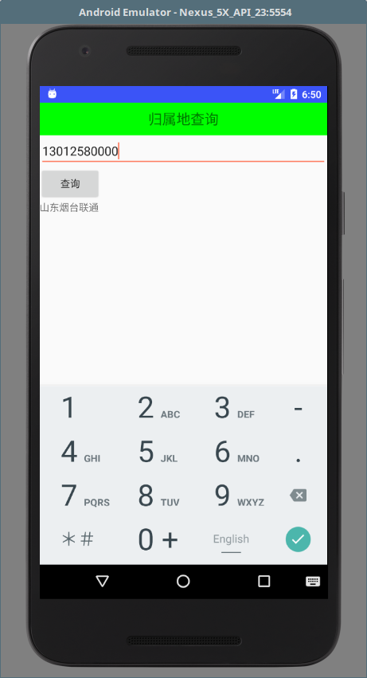

# MobileSafe 《手机卫士》
Android手机卫士，代码阅读对象：Android 开发者，项目代码中有很多API调用的有利参考。

项目在编写时测试手机为Android 4.4.2，可能有的API由于Android版本的升级，如Android 6以后严格限制一些权限的使用，所以部分功能已经不能在高版本Android上顺利实现，如程序锁。此项目是Android基础综合的一个项目，自定义控件、服务、网络等基本用到，所以学了一些基础控件之后的同学可以尝试阅读此代码，或许会对你的Android基础的巩固有促进作用

## 免责声明
项目由“极客开发者”（jkdev.cn）编写，源代码开放并共享到互联网，模拟手机卫士，如有雷同，纯属巧合，最终解释权属于“极客开发者”。

## APP部分截图：
<p>



</p>
## 1. 介绍
本项目由极客开发者编写，并开源共享源代码，本项目综合Android 基础知识，代码已经几乎添加注释

功能列表：<br>
1).手机防盗<br>
2).通信卫士<br>
3).软件管理<br>
4).进程管理<br>
5).流量统计<br>
6).手机杀毒<br>
7).缓存管理<br>
8).高级工具（包或归属地查询、常用号码查询、程序锁、短信备份）<br>

原项目构建参数如下：<br>
compileSdkVersion 26<br>
buildToolsVersion "26.0.2"<br>
minSdkVersion 15<br>
targetSdkVersion 26<br>


## 2. 代码下载

1.使用git管理工具下载

```markdown
git clone https://github.com/kotlinup/MobileSafe.git
```
2.直接下载：<br>
在github上找到下载按钮直接下载zip包即可<br>

3.使用Android Studio倒入即可

## 3. 参考内容
部分简介内容：<br>
（1）项目使用 xUtils 2.6.14框架实现服务器断端apk升级包的下载;<br>
（2）为了实现电话的拦截功能，使用aidl文件进行反射调用;<br>
（3）通信卫士模块密码使用MD5加密；<br>
（4）主页使用网格布局；<br>
（5）assets目录下包含的数据库文件：病毒数据库、公共号码数据库、归属地查询数据库<br>
更多的内容在代码里面都写了注释。

## 4. 联系开发者：
(1)邮箱：i@jkdev.cn<br>
(2)微信订阅：极客开发者up<br>

